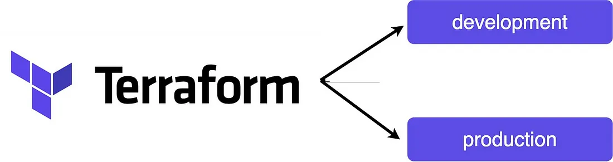

Terraform modules are reusable, self-contained units of configuration in Terraform that encapsulate specific resources or sets of resources with well-defined input variables and output values. They allow you to abstract and organize your infrastructure code into reusable components, making it easier to manage and maintain complex infrastructure configurations.

A Terraform module typically consists of the following components:

Input Variables: These are parameters that users of the module can set to customize the behavior of the module. Input variables allow you to provide different values for each module, making it flexible and adaptable to various use cases.
Resources: These are the AWS, Azure, Google Cloud, or other cloud provider resources that the module creates and manages.
Output Values: These are the results or information that the module exposes to the calling configuration. Output values can be used to pass information from the module to other parts of the Terraform configuration.

By defining resources, input variables, and output values within a module, you can create a reusable building block for your infrastructure. Once you have created a module, you can use it in multiple Terraform configurations, passing different input variable values to customize each module instance.

These codes use terraform modules to maintain different infrastructures for different environments!

ref
https://medium.com/@109manojsaini/manage-multiple-environments-with-terraform-modules-8f3fcb2eb967